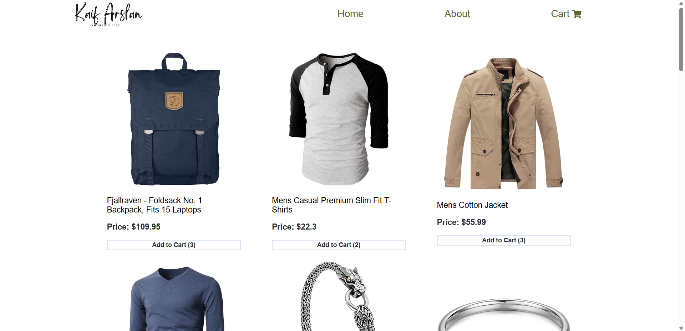
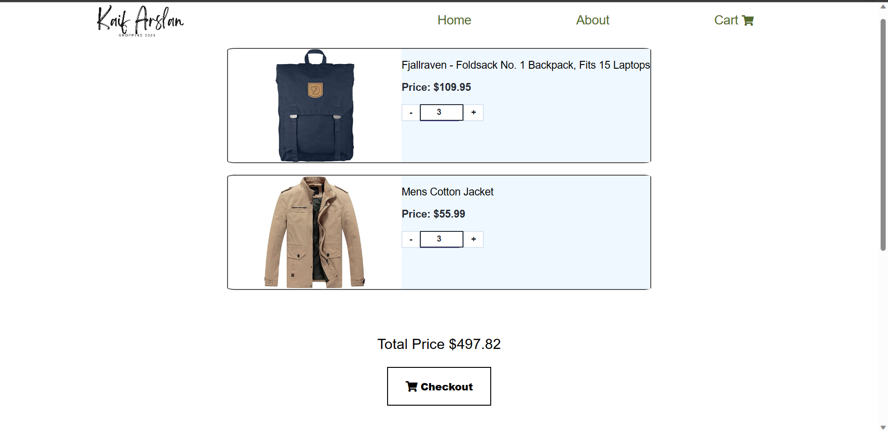

# Shopping Site 

## Table of Contents

- [Introduction](#introduction)
- [Features](#features)
- [Screenshots](#screenshots)
- [Setup](#setup)
- [Usage](#usage)
- [Contributing](#contributing)
- [License](#license)

## Introduction

This is a dummy shopping site project built with React. It is a basic e-commerce website where users can browse through various products and add them to their cart. The project is intended to demonstrate the use of React components, state management, and basic interactions with a shopping cart.

## Features

- Browse through a list of products
- View individual product details
- Add products to the cart
- View the shopping cart and adjust quantities
- Calculate the total cost of items in the cart
- Place an order (dummy functionality)

## Screenshots

*Screenshot of the Shopping Site*

*Screenshot of the Shopping Site Cart*

## Setup

To run this project locally, follow these steps:

1. Clone the repository:
  git clone https://github.com/your-username/dummy-shopping-site.git
  cd dummy-shopping-site

2. Install dependencies by typing 'npm install' in the terminal. (make sure you have npm installed)

## Usage

Start the development server:

Open your web browser and visit `http://localhost:3000` to see the dummy shopping site in action.

## Contributing

Contributions are welcome! If you find any issues or have ideas for improvements, feel free to open an issue or submit a pull request. Make sure to follow the project's code style and conventions.

1. Fork the repository.
2. Create a new branch: `git checkout -b my-feature`
3. Make your changes and commit them: `git commit -m "Add feature"`
4. Push your changes to the branch: `git push origin my-feature`
5. Submit a pull request.

